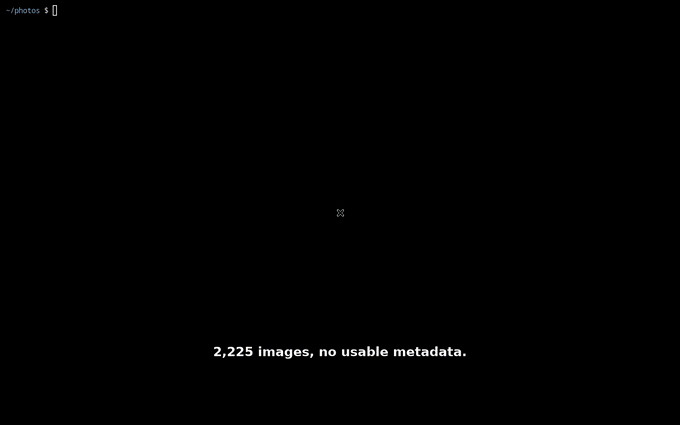

# photo-triage

I switched phones, and WhatsApp handed over a folder with thousands of images
in it. Most of them were memes, screenshots and forwarded shop listings. A few
hundred were photographs of people I actually care about, and there was nothing
in the filenames to tell me which was which.

This is what I wrote to sort that out. Point it at the folder and it embeds
every image and video with CLIP on your own GPU, then gives you a browser UI
where you can search them by describing them, select in bulk, and move the
rubbish into a quarantine folder that mirrors your original structure.

It never talks to the network. There is no account, no API key and no upload
step, and the UI works with the wifi off, because these are my photographs and
they stay on my machine.

```bash
uvx --torch-backend=auto --from "photo-triage[model]" photo-triage ~/whatsapp-export
#   http://127.0.0.1:63029
```

On an AMD GPU use `--torch-backend=rocm6.3`. See [Run it](#run-it).

The port is derived from the folder's path, so it is the same every time you
open that folder and a bookmark keeps working, two folders can be triaged side
by side without being told about each other, and nothing lands on 5000, which
is Flask's default and is taken by AirPlay Receiver on macOS. `--port` if you
want to choose.



*44 seconds, real time. [Full resolution](docs/demo.mp4).*

## Why it works this way

The obvious approaches all fail on a WhatsApp export, and it is worth knowing
why before trusting this one.

Messaging apps strip EXIF on send. Across 23,584 images from a real export,
only 2.5% still carried camera metadata, so there is no date or device to sort
by. Filenames like `IMG-20240512-WA0158.jpg` record when something was
forwarded to you, not what is in it. Memes and photographs overlap completely
on file size and dimensions. Perceptual-hash deduplication, which does work,
only found 3.6% redundancy, so it trims the pile rather than sorting it.

That leaves the picture itself. CLIP reads every image once, and after that
every question you can ask is arithmetic on the cached result.

## What you can do with it

Type `birthday cake`, `receipt`, or `people at the beach` into the search box.
The query goes through the same model as your images and every photo gets
ranked against it, which takes milliseconds because the image side was computed
once, in advance. It matches the picture rather than any text, so it works
across languages: an English query for `chess meme` pulls up Spanish-language
chess memes.

Press `F` on any photo to rank the whole folder by how much it looks like that
one. This is how you clear a meme and every re-send of it in one sweep.

Videos are searched the same way. A clip is sampled about once every two
seconds and every sampled moment is embedded and kept, so a search for
`birthday cake` finds the clip that has a cake in the middle of it. Averaging
those moments into one vector is the obvious shortcut and it throws away the
thing you were looking for: a clip that starts at a party and ends in the car
averages to something that matches neither. What it cannot do is hear. A video
that matters because of what someone says will not turn up, since CLIP only
looks.

Zero-shot classification sorts everything into categories, grouped as junk,
review and keep. The prompts live in an editable `prompts.json`, and
re-running classification with better ones takes seconds, because the
embeddings are already sitting there.

Duplicates are found three ways. Exact copies are matched on a hash of the
decoded pixels rather than the file bytes, so two files that differ only in
EXIF still match, which is what a forward-and-forward-back produces. Near
copies are matched perceptually, which catches the resizing an app does on the
way through. Re-sends are near copies dated a year apart, and they are worth
seeing separately, because the newer copy is usually the worse one.

Nothing gets deleted. Images move into a quarantine tree that mirrors your
folder structure, which you can browse and search with the same tools, and any
batch can be restored, not only the most recent.

## Run it

Nothing to install. Point it at a folder and it does the rest:

```bash
# NVIDIA, Apple Silicon, or no GPU at all
uvx --torch-backend=auto --from "photo-triage[model]" photo-triage ~/whatsapp-export

# AMD
uvx --torch-backend=rocm6.3 --from "photo-triage[model]" photo-triage ~/whatsapp-export
```

It scans, embeds, classifies and thumbnails the whole folder, showing progress
in the terminal, and only then prints the address to open. The first run pulls
about 600 MB of model weights; every run after that starts from the cache and
embeds only what is new.

## Install it

If you would rather have it on your PATH than type `uvx` each time:

```bash
uv tool install "photo-triage[model]" --torch-backend=auto      # NVIDIA, Apple, CPU
uv tool install "photo-triage[model]" --torch-backend=rocm6.3   # AMD

photo-triage ~/whatsapp-export
```

Without [uv](https://docs.astral.sh/uv/), `pipx install photo-triage` works,
but you then pick and install the PyTorch wheel yourself.

### Why the backend has to be named on AMD

PyTorch ships a different wheel per accelerator and they are not
interchangeable. The wheel on PyPI is a CUDA build, and on a Radeon it gives
you an install that runs about twenty times slower than your hardware can.
`--torch-backend` makes uv rewrite the index for exactly those packages, which
is why `photo-triage[model]` can declare `torch` like a normal dependency and
still resolve to the right build.

`auto` is right on NVIDIA, on Apple Silicon and on a machine with no GPU. It is
wrong on AMD: it reads NVIDIA drivers, finds none, and settles on the CPU
build, so a Radeon needs `rocm6.3` spelled out. photo-triage notices when the
build does not match the hardware and tells you, rather than quietly running
twenty times slower.

### Browsing without the model

Drop the `[model]` extra if you only want to browse, filter, quarantine and
restore a folder somebody else embedded. Everything except embedding and text
search works without PyTorch, and photo-triage prints the command above if you
ask for something that needs it.

### On a GPU

The CUDA and ROCm wheels bundle their own runtime, so there is no system
toolkit and no sudo involved. On AMD you need the `amdgpu` kernel driver and
read/write access to `/dev/dri/renderD*`. ROCm is pinned to 6.3, because the
architecture override below is documented to segfault from 6.4.3 up.

Consumer Radeons that AMD does not officially support but which work anyway,
like the RX 6700 XT, are handled without you doing anything. photo-triage reads
the architecture, sets `HSA_OVERRIDE_GFX_VERSION` itself, and logs the value so
you can reproduce it by hand. If a device enumerates and then fails a test
matmul, it drops to the CPU with a warning rather than dying forty minutes into
a run.

## Speed

Measured on 23,584 images, Ryzen 7 5700G and Radeon RX 6700 XT:

| Stage | Time |
|---|---|
| scan | 108 s |
| embed on GPU | 78 s |
| embed on CPU | over 20 minutes |
| classify | under 5 s |
| thumbnails | 65 s |

Embedding is the expensive step and it happens once. After that, every question
you ask is a dot product against a matrix that fits in RAM. At batch 128 the
GPU uses 0.8 GB of VRAM and is barely working: JPEG decoding on the CPU is the
bottleneck, not inference.

## Commands

```
photo-triage <folder>                # scan, embed, classify, thumbnail, serve
photo-triage <folder> --no-serve     # build caches only
photo-triage <folder> --reclassify   # re-run classification with edited prompts
photo-triage <folder> --status       # counts: indexed, quarantined, saved
photo-triage <folder> --dedupe       # report duplicates, moves nothing
photo-triage purge <folder>          # permanently empty quarantine, asks first
photo-triage restore-all <folder>
```

Every stage is resumable and idempotent, keyed on path, size and mtime. Add
more photos and re-run, and it embeds only the new ones.

Video needs `python-av`, which is installed with everything else and carries
its own ffmpeg. A photograph owns one vector in the cache and a clip owns one
per sampled moment, which is why `embeds.npy` has more rows than you have
files.

## Keyboard

| Key | Action |
|---|---|
| `A` | select everything shown |
| `D` | quarantine the selection |
| `S` | save and protect, so it can never be deleted |
| `C` | clear selection |
| `U` | undo the last quarantine batch |
| `R` | restore, in the quarantine view |
| `F` | find visually similar to the photo or clip under the cursor |
| `?` | shortcuts, `Esc` closes |

With nothing selected, `S` and `F` act on whatever the cursor is over, so you
can sweep across the grid hovering and tapping. Click toggles, shift-click
takes a range, double-click opens the lightbox.

## What it stores

Everything lives in `<folder>/.phototriage/`. Delete that directory and the
tool has left no trace.

```
.phototriage/
├── index.jsonl     # per-file metadata and perceptual hashes
├── embeds.npy      # float32, L2-normalised, one row per sampled moment
├── paths.json      # row id to relative path
├── scored.json     # category and confidence per row
├── prompts.json    # editable category prompts
├── journal.jsonl   # append-only log of every move, the source of truth
├── thumbs/
└── quarantine/     # mirrors your folder structure
```

Quarantine sits on the same filesystem as your photos, so moving a file there
is a rename rather than a copy, however big the pile. It mirrors your directory
tree, so two files called `IMG_0042.jpg` in different folders never collide on
the way back. And it is an ordinary folder: if this tool broke completely you
could drag everything out of it in a file manager.

Purging is the one destructive operation. It is a separate command that prints
what it is about to delete and waits for you to confirm.

## Read this before you trust it

The model is confidently wrong in specific, predictable ways. A photo of a bed
in someone's bedroom comes back as `product` at 0.92. A woman standing beside a
cartoon mural comes back as `sticker_art` at 0.99. The confident mistakes are
the dangerous ones, precisely because a confident answer is the one a person
stops checking.

This is not hypothetical, and it is the reason the tool is shaped the way it
is. My first attempt at this had a fast grid and a one-key delete, and I used
it to remove 21,488 of my 23,584 images. That included 1,617 of the 2,454
photos of people and 1,209 of the 1,239 photos of animals. Two I pulled back
out of the bin at random were a child in a football kit and three friends
laughing at a party. The model had been confident about both.

So this version is built the other way round:

- confidence on its own never authorises a deletion;
- `product` and `document` stay out of the junk group, whatever the model
  thinks of them;
- a category has to be seen in review mode, which shows it large and sorted by
  confidence with the guessing threshold drawn across it, before anything can
  sweep it in bulk;
- selecting what is on screen and selecting everything that matches are
  separate actions, and the second is only offered once you ask for the first;
- images are quarantined rather than deleted, and any batch can come back.

## Reproducing the demo

The recording is a real terminal running the real CLI and a real browser
driving the real server, over 2,225 real photographs, captured on a virtual X
display. The scripts that build the dataset, drive the session and cut the
video are in [demo/](demo/), along with [notes on running
them](demo/README.md).

## Development

```bash
uv pip install -e . pytest && uv run pytest
```

The tests do not need PyTorch, since only embedding and text search do. They
cover the parts that can lose data: quarantine and restore round-trips
including colliding basenames, restoring an arbitrary earlier batch,
server-side enforcement of protection, agreement between the two endpoints that
answer "what matches", resumable embedding, and exact deduplication across
differing EXIF.

Three documents carry the intent behind the code. [PROJECT.md](PROJECT.md) owns
behaviour: architecture, endpoints, data model, and a Pitfalls section that is
the most useful thing in the repository. [DESIGN.md](DESIGN.md) owns
appearance. [STYLE.md](STYLE.md) owns the shape of the code, after Ousterhout's
*A Philosophy of Software Design*.

## Licence

MIT.
